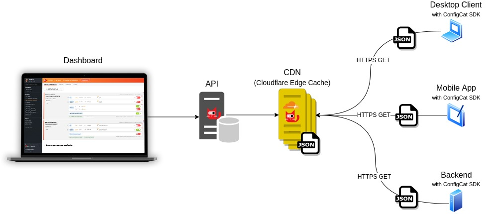

# ConfigCat Feature Flags

[ConfigCat is a hosted feature flag and configuration management service](https://configcat.com/) that lets you separate releases from deployments. You can turn your features ON/OFF using ConfigCat Dashboard even after they are deployed. ConfigCat lets you target specific groups of users based on region, email or any other custom user attribute. Manage feature toggles across frontend, backend, mobile, desktop apps.

## 🔥 How does ConfigCat work?
- You set your feature flags on the ConfigCat Dashboard.
- Your feature flags get distributed across the ConfigCat CDN.
- The ConfigCat SDK in your application downloads and evaluates the feature flags.

##  🤓 Get started with ConfigCat
- Website: https://configcat.com/
- Dashboard: https://app.configcat.com/
- API: https://api.configcat.com/docs/
- Docs: https://configcat.com/docs/
- Blog: https://configcat.com/blog/

## 💸 Plans & Pricing
[See Pricing](https://configcat.com/pricing/)

## 🚀 Open-source SDKs
The purpose of the SDKs are to download, cache feature flag values and to evaluate targeting rules. All SDKs provide a simple interface to access your feature flags from your application.
- [.NET, .NET Core](https://configcat.com/docs/sdk-reference/csharp/)
- [Java](https://configcat.com/docs/sdk-reference/java/)
- [Android](https://configcat.com/docs/sdk-reference/android/) (Kotlin)
- [iOS](https://configcat.com/docs/sdk-reference/ios/) (Swift)
- [JavaScript](https://configcat.com/docs/sdk-reference/js/) (Browser)
- [JavaScript](https://configcat.com/docs/sdk-reference/js-ssr/) (Server-Side Rendered - SSR)
- [Node.js](https://configcat.com/docs/sdk-reference/node/)
- [Python](https://configcat.com/docs/sdk-reference/python/)
- [Go](https://configcat.com/docs/sdk-reference/go/)
- [PHP](https://configcat.com/docs/sdk-reference/php/)
- [Ruby](https://configcat.com/docs/sdk-reference/ruby/)
- [Elixir](https://configcat.com/docs/sdk-reference/elixir/)
- [Dart](https://configcat.com/docs/sdk-reference/dart/) (Flutter)

# 👯 Integrations
Integrate ConfigCat with your technology stack and leverage all the benefits of Feature flags within your workflows.
- [Slack](https://configcat.com/docs/integrations/slack/) - Get notified when a feature flag changes.
- [Jira Cloud Plugin](https://configcat.com/docs/integrations/jira/) - Manage feature flags right from Jira
- [Trello Power-Up](https://configcat.com/docs/integrations/trello/) - Manage feature flags right from your Trello board
- [monday.com](https://configcat.com/docs/integrations/monday/) - Manage feature flags right from your monday.com board
- [Datadog](https://configcat.com/docs/integrations/datadog/) - Send feature flag change events to your monitors
- [Zapier Zap](https://configcat.com/docs/integrations/zapier/) - Build workflows based on feature flags
- [Zoho Flow](https://configcat.com/docs/integrations/zoho-flow/) - Automate tasks and build feature flag based workflows
- [GitHub Action](https://configcat.com/docs/integrations/github/) - Scan source code for unused feature flags
- [CircleCI Orb](https://configcat.com/docs/integrations/circleci/) - Scan source code for unused feature flags
- [Bitbucket Pipe](https://configcat.com/docs/integrations/bitbucket/) - Scan source code for unused feature flags
- [Bitrise Step](https://configcat.com/docs/integrations/bitrise/) - Scan source code for unused feature flags
- [Terraform](https://configcat.com/docs/integrations/terraform/) - Manage feature flags directly from HCL scripts
- [Amplitude](https://configcat.com/docs/integrations/amplitude/) - Add feature flag changes to your charts
- [Visual Studio Code](https://configcat.com/docs/integrations/vscode/) - Manage feature flags right from your VSCode editor

## 💁🏼 Contributing
Feedback and contribution are welcome. [See contribution guide](../CONTRIBUTING.md).

## ☎️ Help & Support
- [FAQ](https://configcat.com/docs/faq/) - Frequently Asked Questions
- [Contact us](https://configcat.com/support/)

<!--

**Here are some ideas to get you started:**

🙋‍♀️ A short introduction - what is your organization all about?
🌈 Contribution guidelines - how can the community get involved?
👩‍💻 Useful resources - where can the community find your docs? Is there anything else the community should know?
🍿 Fun facts - what does your team eat for breakfast?
🧙 Remember, you can do mighty things with the power of [Markdown](https://docs.github.com/github/writing-on-github/getting-started-with-writing-and-formatting-on-github/basic-writing-and-formatting-syntax)
-->
